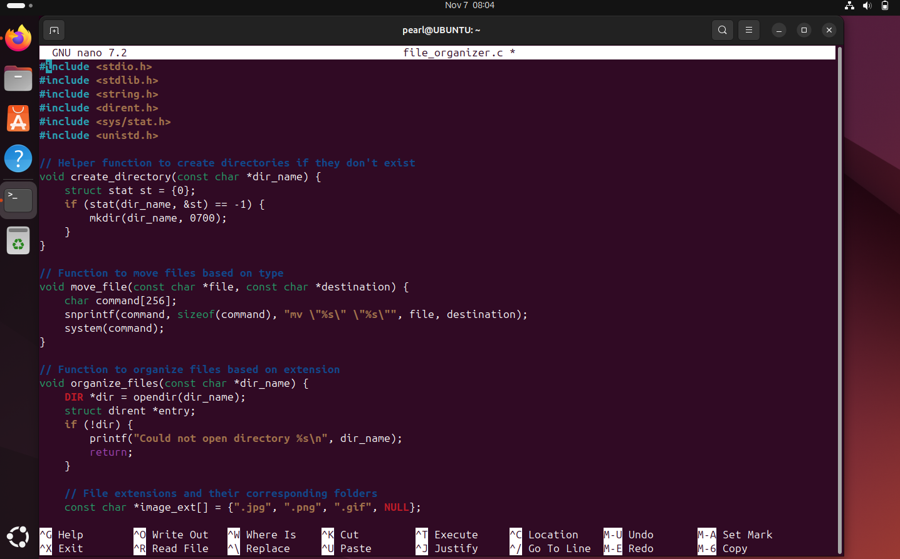
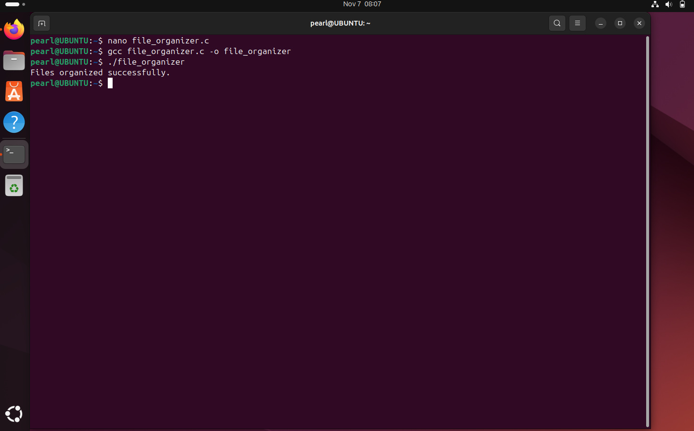
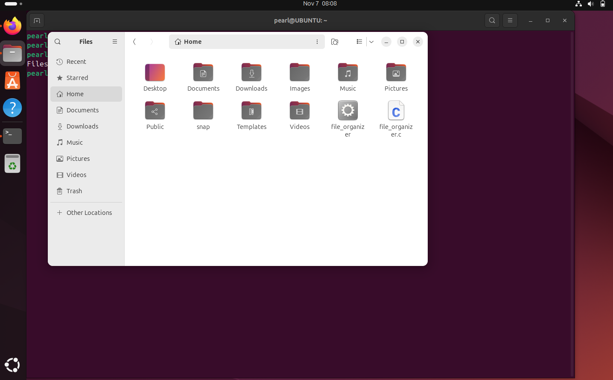

# File_Management_Sys

This project is a simple file organizer script written in C for Linux (Ubuntu). It organizes files in a directory based on their extensions into specific folders (Images, Documents, Videos).

## Step-by-Step Setup Guide

### Step 1: Install GCC Compiler

We need the GCC compiler to compile our C program. Use the following command to install GCC:

```sh
sudo apt install gcc
```

### Step 2: Create the file_organizer.c File

Create a new C file named file_organizer.c and open it with a text editor (e.g., nano):

```sh
nano file_organizer.c
```

### Step 3: Write the C Program for File Organizer

Copy and paste the following code into the file_organizer.c file:

```sh
#include <stdio.h>
#include <stdlib.h>
#include <string.h>
#include <dirent.h>
#include <sys/stat.h>
#include <unistd.h>

// Helper function to check if a file exists
int file_exists(const char *path) {
    struct stat buffer;
    return (stat(path, &buffer) == 0);
}

// Helper function to create a directory if it doesn't exist
void create_directory(const char *dir_name) {
    struct stat st = {0};
    if (stat(dir_name, &st) == -1) {
        // Directory doesn't exist, create it
        if (mkdir(dir_name, 0700) != 0) {
            perror("Error creating directory");
            exit(1);
        }
        printf("Directory created: %s\n", dir_name);
    }
}

// Helper function to generate a unique file name
void generate_unique_name(const char *directory, const char *file_name, char *unique_name, size_t unique_name_size) {
    char base_name[256];
    char extension[256];
    int counter = 1;

    // Split the file name into base name and extension
    const char *dot = strrchr(file_name, '.');
    if (dot) {
        strncpy(base_name, file_name, dot - file_name);
        base_name[dot - file_name] = '\0';
        strncpy(extension, dot, sizeof(extension));
    } else {
        strncpy(base_name, file_name, sizeof(base_name));
        extension[0] = '\0';
    }

    // Add a check to ensure we don’t exceed buffer size
    if (strlen(directory) + strlen(base_name) + strlen(extension) + 10 > unique_name_size) {
        fprintf(stderr, "Error: File name too long.\n");
        exit(1);
    }

    // Generate unique name safely
    snprintf(unique_name, unique_name_size, "%s/%s%s", directory, base_name, extension);
    while (file_exists(unique_name)) {
        snprintf(unique_name, unique_name_size, "%s/%s[%d]%s", directory, base_name, counter++, extension);
    }
}

// Function to organize files by extension
void organize_files(const char *dir_name) {
    DIR *dir = opendir(dir_name);
    struct dirent *entry;

    if (!dir) {
        perror("Could not open directory");
        return;
    }

    while ((entry = readdir(dir)) != NULL) {
        if (entry->d_type == DT_REG) { // Only process regular files
            const char *file_name = entry->d_name;

            // Skip specific files like file_organizer.c and file_watcher.c
            if (strcmp(file_name, "file_organizer.c") == 0 || strcmp(file_name, "file_watcher.c") == 0) {
                printf("Skipping file: %s\n", file_name);
                continue;
            }

            const char *ext = strrchr(file_name, '.');

            if (ext) {
                char target_dir[256];
                if (strcmp(ext, ".jpg") == 0 || strcmp(ext, ".jpeg") == 0 || strcmp(ext, ".png") == 0) {
                    strcpy(target_dir, "Images");
                } else if (strcmp(ext, ".pdf") == 0 || strcmp(ext, ".docx") == 0 || strcmp(ext, ".txt") == 0 || strcmp(ext, "pptx") == 0) {
                    strcpy(target_dir, "Documents");
                } else if (strcmp(ext, ".mp4") == 0 || strcmp(ext, ".mkv") == 0) {
                    strcpy(target_dir, "Videos");
                } else if (strcmp(ext, "mp3") == 0) {
                    strcpy(target_dir, "Music");
                } else {
                    strcpy(target_dir, "Others");
                }

                // Create the target directory if it doesn't exist
                create_directory(target_dir);

                // Generate a unique name for the target file
                char unique_name[512];
                generate_unique_name(target_dir, file_name, unique_name, sizeof(unique_name));

                // Move the file to the target directory
                char source_path[512];
                snprintf(source_path, sizeof(source_path), "%s/%s", dir_name, file_name);

                if (rename(source_path, unique_name) == 0) {
                    printf("Moved: %s -> %s\n", source_path, unique_name);
                } else {
                    perror("Error moving file");
                }
            }
        }
    }

    closedir(dir);
}

int main() {
    const char *current_directory = "."; // Current directory
    organize_files(current_directory);
    printf("File organization completed.\n");
    return 0;
}
```

Save the file and exit the text editor (Ctrl+X, then Y, and Enter for nano).



### Step 4: Compile the Program

Compile the C program using GCC:

```sh
gcc file_organizer.c -o file_organizer
```

### Step 5: Run the Program

Execute the compiled program to organize files in the current directory:

```sh
./file_organizer
```



This will organize the files in the current directory into Images, Documents, and Videos folders.
